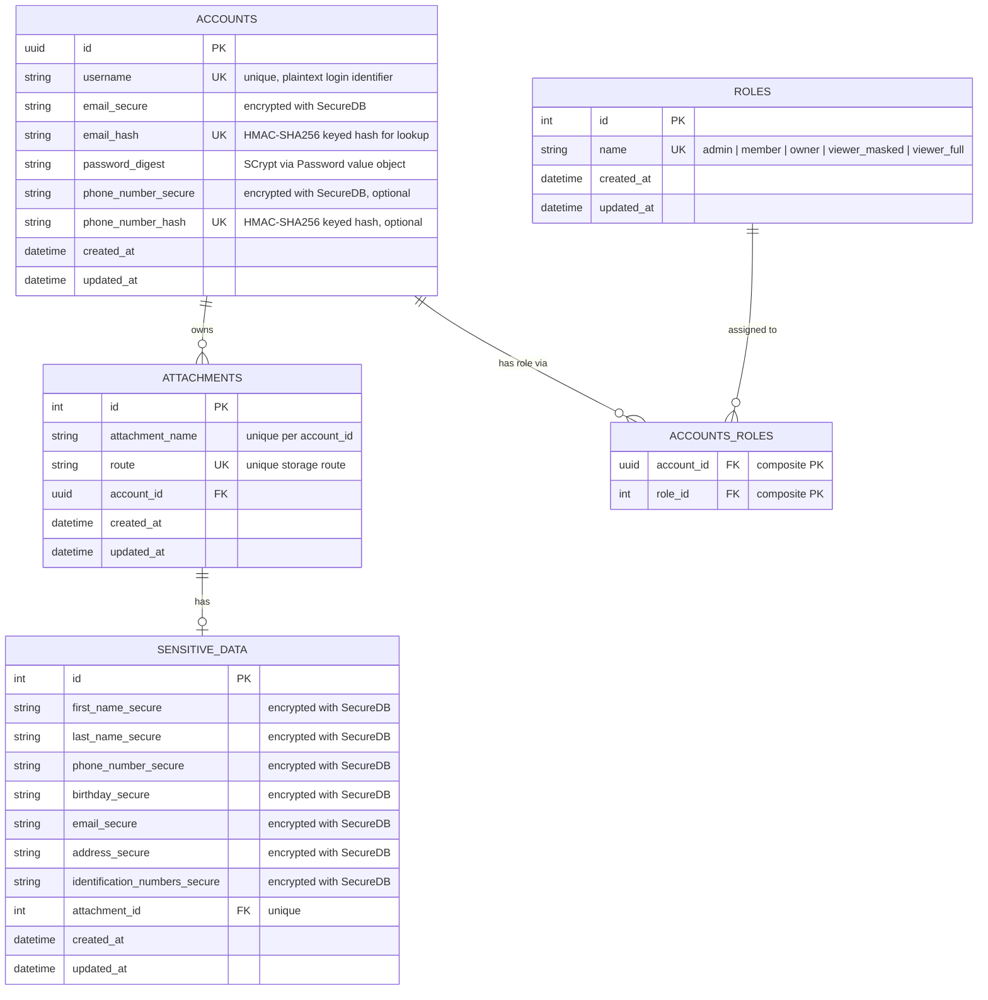

# Database Schema

LockedCV's relational schema as migrated on the current branch. GitHub renders
the Mermaid block below as a diagram; the notes capture the design decisions
that are not obvious from an ERD, especially encryption, keyed lookup hashes,
password storage, role assignment, and deferred authorization work.

## Entity-Relationship Diagram

## Notes

### Encryption at Rest

- **`accounts.email_secure`** and **`accounts.phone_number_secure`** store
  encrypted account PII through `SecureDB.encrypt`. The ciphertext is
  non-deterministic and reversible only with `DB_KEY`.
- **`accounts.email_hash`** and **`accounts.phone_number_hash`** store keyed
  HMAC lookup hashes through `SecureDB.hash`. These values are deterministic,
  which supports equality lookup and uniqueness checks without storing
  plaintext PII.
- **`sensitive_data.*_secure`** columns store resume/document PII only as
  encrypted values. The model exposes plaintext getters/setters, but the
  database persists only ciphertext.

### Password Storage

- **`accounts.password_digest`** stores the serialized output of the
  `Password` value object, not plaintext.
- Password hashing uses the `KeyStretch` module with SCrypt via RbNaCl. The
  digest includes salt and hash material needed for verification.
- API responses and authentication responses must never include `password` or
  `password_digest`.

### Role Model

The `roles` table stores canonical role names. Current names are split by
intended use:

| Role            | Category       | Current status                         |
| --------------- | -------------- | -------------------------------------- |
| `admin`         | System-level   | Used by system role assignment demo    |
| `member`        | System-level   | Returned to the Web App after login    |
| `owner`         | Resource-level | Deferred authorization design          |
| `viewer_masked` | Resource-level | Deferred authorization design          |
| `viewer_full`   | Resource-level | Deferred authorization design          |

`accounts_roles` currently supports system role assignment and the minimal
admin-only authorization demo. Full resource-level authorization for
attachments and sensitive data is deferred until the sharing model and policy
layer are defined.

### Authentication and Authorization Status

- Authentication is implemented through `POST /api/v1/auth/authenticate`.
- Successful authentication returns safe account data for the Web App session:
  account ID, username, email, and role names.
- `PUT /api/v1/accounts/:username/system_roles/:role_name` demonstrates API
  authorization by requiring the current account to have the `admin` role.
- Attachment and sensitive data routes do not yet enforce `owner`,
  `viewer_masked`, or `viewer_full` permissions.

### Uniqueness and Integrity

- **`accounts.username`** is unique and currently used as the login identifier.
- **`accounts.email_hash`** is unique, allowing duplicate email prevention
  without plaintext storage.
- **`accounts.phone_number_hash`** is unique when present.
- **`attachments.route`** is unique.
- **`attachments`** has a unique constraint on `(account_id, attachment_name)`.
- **`sensitive_data.attachment_id`** is unique, so each attachment has at most
  one sensitive data record.
- **`roles.name`** is unique.
- **`accounts_roles`** uses a composite primary key on `(account_id, role_id)`,
  preventing duplicate role assignments.

### Cascade Behavior

- `Account#destroy` destroys associated attachments through
  `association_dependencies`.
- `Attachment#destroy` destroys associated sensitive data through
  `association_dependencies`.
- Role assignment rows are stored in `accounts_roles`; duplicate assignments
  are prevented by the composite primary key.
